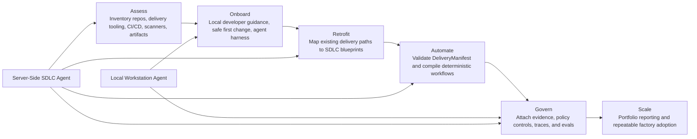

# Factory Fit Profiler Product Specification

## Purpose

Factory Fit Profiler is the architectural adaptation layer for applying an SDLC factory across heterogeneous private-equity portfolio companies. It converts current-state repository, delivery, developer-workflow, and governance evidence into a recommended factory adoption path.

The product exists because standardization fails when imposed before discovery. Factory Fit Profiler first determines factory fit, then recommends onboarding, remediation, automation, and governance actions that can be repeated across companies.

## Product Thesis

```text
Assess → Onboard → Retrofit → Automate → Govern → Scale
```

This lifecycle is the canonical model for the README, diagrams, contracts, and architecture documentation. Any future diagram that describes the tool should preserve these six stages or explicitly explain why a stage is out of scope for that view.

## Users and Jobs To Be Done

| User | Job |
| --- | --- |
| PE operating partner | Compare SDLC maturity across companies and identify standardization opportunities. |
| Engineering leader | Understand which applications are ready for factory adoption and which need remediation. |
| Platform team | Convert evidence-backed recommendations into reusable SDLC blueprints. |
| Developer | Learn a safe local agentic workflow and make governed changes in an existing repository. |
| Governance or security reviewer | Trace recommendations, generated workflows, and agent outputs back to evidence and policy. |

## Execution Modes

Factory Fit Profiler has two coordinated modes that share evidence, policy, trace, eval, and manifest contracts.

### Local Workstation Agent

The local workstation agent runs under human control on a developer machine. It helps developers inspect a repository, understand safe change boundaries, generate a minimal agent harness, and evaluate patch quality before broader automation is introduced.

### Server-Side SDLC Agent

The server-side agent runs as a containerizable service. In the MVP it uses fixtures rather than live DevOps integrations. It inventories repositories and delivery signals, recommends blueprints, validates delivery manifests, and compiles deterministic CI/CD workflow output from valid manifests.

## Architecture Basis

The architecture is evidence-first and contract-centered:

1. **Inputs**: repositories, manifests, build metadata, CI/CD signals, scanner signals, developer workflow notes, and portfolio/company profile data.
2. **Assessment layer**: inventory and classification components extract current-state delivery facts and evidence.
3. **Recommendation layer**: blueprint selection maps facts to standardization lanes and remediation paths.
4. **Automation layer**: validated manifests compile into deterministic workflow artifacts.
5. **Governance layer**: evidence, policy, traces, and evals remain attached to findings and generated outputs.
6. **Scale layer**: comparable reports and blueprint recommendations let operators repeat the approach across companies.

## Canonical Product Diagram



The README architecture diagram must stay semantically aligned with this diagram: the six lifecycle stages, local/server mode split, and governance-through-contracts model should match.

## MVP Scope

The MVP proves a vertical slice without production DevOps connectivity:

- Fixture-backed portfolio inventory.
- Blueprint recommendation from repository and delivery signals.
- Delivery manifest validation.
- Deterministic GitHub Actions workflow compilation.
- Static company profile demo for browser-only readiness visualization.
- Local workstation guidance for safe agentic coding workflows.

## Non-Goals

The MVP does not connect to live enterprise DevOps systems, mutate remote platforms, read secrets, push code, open production pull requests, install system dependencies automatically, orchestrate deployments, or provide unrestricted desktop control.

## Shared Contracts

Factory Fit Profiler treats the following contracts as product architecture, not implementation detail:

- `DeliveryManifest` for application identity, runtime, build/test/scan commands, package metadata, and evidence outputs.
- Evidence records for claims and recommendations.
- Policy records for allowed, approval-gated, and forbidden actions.
- Trace records for execution history and auditability.
- Eval records for repeatable scoring of patches and agent output.

## Success Criteria

- Operators can compare factory readiness across applications and companies.
- Developers receive safe, local guidance before automation expands.
- Blueprint recommendations are tied to evidence rather than undocumented judgement.
- Generated workflow artifacts are deterministic and derived from validated manifests.
- Governance artifacts make recommendations auditable and repeatable.
